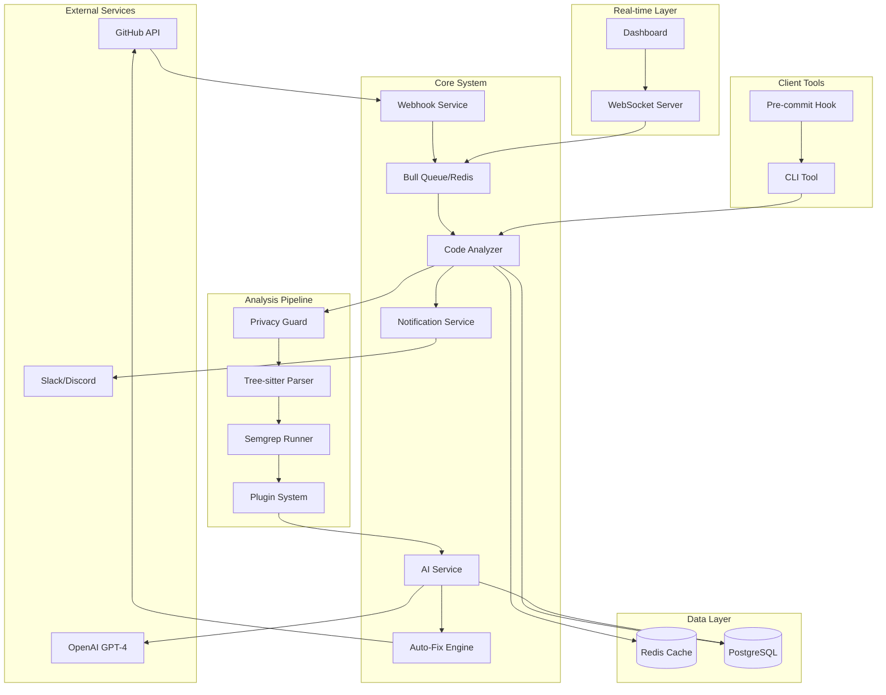

# Design Document

## Overview

The AI Code Review Bot is designed as a microservices-based system that processes GitHub webhook events, analyzes code using a hybrid approach of static analysis tools and LLM-powered intelligence, and provides automated feedback with fix generation. The system emphasizes privacy, cost transparency, and extensibility while maintaining high performance and reliability.

## Architecture

### High-Level Architecture



### System Components

The system follows a modular architecture with clear separation of concerns:

1. **Webhook Service**: Fastify-based HTTP server handling GitHub webhooks
2. **Queue System**: Bull queue with Redis for asynchronous processing
3. **Code Analyzer**: Orchestrates the analysis pipeline
4. **Privacy Guard**: PII/secret detection and redaction
5. **Static Analysis Layer**: Semgrep integration for pattern detection
6. **AI Service**: OpenAI integration with cost tracking
7. **Auto-Fix Engine**: Git operations and PR creation
8. **Plugin System**: Dynamic rule loading and execution
9. **Notification Service**: Slack/Discord integration
10. **Dashboard**: React-based metrics and visualization
11. **CLI Tool**: Command-line interface for local development
12. **WebSocket Server**: Real-time updates for dashboard

## Components and Interfaces

### Webhook Service

**Purpose**: Receives and validates GitHub webhook events

**Interface**:
```typescript
interface WebhookService {
  handlePullRequest(event: PullRequestEvent): Promise<void>
  validateSignature(payload: string, signature: string): boolean
  extractChangedFiles(event: PullRequestEvent): Promise<ChangedFile[]>
}

interface ChangedFile {
  filename: string
  status: 'added' | 'modified' | 'removed'
  patch: string
  language: string
}
```

**Key Features**:
- Webhook signature validation using HMAC-SHA256
- Event filtering for relevant PR actions (opened, synchronized)
- Rate limiting and request deduplication
- Graceful error handling with retry logic

### Code Analyzer

**Purpose**: Orchestrates the complete analysis pipeline

**Interface**:
```typescript
interface CodeAnalyzer {
  analyzePR(prData: PRAnalysisRequest): Promise<AnalysisResult>
  loadConfiguration(repoPath: string): Promise<ReviewConfig>
}

interface PRAnalysisRequest {
  repository: Repository
  pullRequest: PullRequest
  changedFiles: ChangedFile[]
}

interface AnalysisResult {
  findings: Finding[]
  metrics: AnalysisMetrics
  autoFixAvailable: boolean
  totalCost: number
}
```

**Processing Flow**:
1. Load repository configuration (.ai-review.yml)
2. Apply privacy guard to redact sensitive data
3. Parse code using Tree-sitter for AST generation
4. Run Semgrep for static analysis pre-filtering
5. Execute custom plugins
6. Send filtered issues to AI service for analysis
7. Generate auto-fixes where applicable
8. Aggregate results and calculate costs

### Privacy Guard

**Purpose**: Detect and redact sensitive information before AI processing

**Interface**:
```typescript
interface PrivacyGuard {
  redactSecrets(code: string): RedactionResult
  detectPII(code: string): PIIDetection[]
}

interface RedactionResult {
  sanitizedCode: string
  redactions: Redaction[]
}

interface Redaction {
  type: 'email' | 'api_key' | 'password' | 'token' | 'pii'
  pattern: string
  replacement: string
  line: number
}
```

**Detection Patterns**:
- Email addresses: `/[a-zA-Z0-9._%+-]+@[a-zA-Z0-9.-]+\.[a-zA-Z]{2,}/g`
- API keys: `/sk_[a-zA-Z0-9]{32}/g`, `/ghp_[a-zA-Z0-9]{36}/g`
- AWS credentials: `/AKIA[0-9A-Z]{16}/g`
- Database URLs: `/postgresql:\/\/.*:.*@/g`
- Credit card numbers: `/\b\d{4}[\s-]?\d{4}[\s-]?\d{4}[\s-]?\d{4}\b/g`

### AI Service

**Purpose**: Integrate with OpenAI GPT-4 for intelligent code analysis

**Interface**:
```typescript
interface AIService {
  analyzeCode(request: AIAnalysisRequest): Promise<AIAnalysisResponse>
  generateFix(issue: Finding): Promise<FixSuggestion>
  trackUsage(tokens: number, cost: number): Promise<void>
}

interface AIAnalysisRequest {
  code: string
  language: string
  context: string
  existingFindings: Finding[]
}

interface AIAnalysisResponse {
  findings: Finding[]
  confidence: number
  tokensUsed: number
  cost: number
}
```

**Function Calling Schema**:
```typescript
const analysisSchema = {
  name: "analyze_code",
  description: "Analyze code for security, performance, and best practice issues",
  parameters: {
    type: "object",
    properties: {
      findings: {
        type: "array",
        items: {
          type: "object",
          properties: {
            type: { type: "string", enum: ["security", "performance", "style", "bug"] },
            severity: { type: "string", enum: ["critical", "high", "medium", "low"] },
            message: { type: "string" },
            line: { type: "number" },
            column: { type: "number" },
            suggestion: { type: "string" },
            autoFixable: { type: "boolean" }
          }
        }
      }
    }
  }
}
```

### Auto-Fix Engine

**Purpose**: Generate and apply code fixes with CI validation

**Interface**:
```typescript
interface AutoFixEngine {
  generateFix(finding: Finding, context: CodeContext): Promise<Fix>
  createFixBranch(fixes: Fix[], prData: PRData): Promise<FixPR>
  validateWithCI(fixPR: FixPR): Promise<CIResult>
}

interface Fix {
  finding: Finding
  patch: string
  confidence: number
  testable: boolean
}

interface FixPR {
  branchName: string
  prNumber: number
  fixes: Fix[]
  ciStatus: 'pending' | 'running' | 'success' | 'failure'
}
```

**Fix Generation Process**:
1. Analyze issue context and surrounding code
2. Generate patch using AI with high confidence threshold
3. Create fix branch with descriptive naming convention
4. Apply patches with conflict detection
5. Trigger CI pipeline for validation
6. Update GitHub check status based on results

### Plugin System

**Purpose**: Enable custom rule definition and execution

**Interface**:
```typescript
interface Plugin {
  name: string
  version: string
  languages: string[]
  analyze(code: string, ast: any): Promise<Finding[]>
  configure(config: PluginConfig): void
}

interface PluginManager {
  registerPlugin(plugin: Plugin): void
  loadPlugins(configPath: string): Promise<Plugin[]>
  executePlugins(code: string, language: string): Promise<Finding[]>
}
```

**Built-in Plugins**:
- TODO/FIXME detector
- Console.log remover
- Unused import cleaner
- Hardcoded URL detector
- License header validator

### CLI Tool

**Purpose**: Provide local development integration for pre-commit analysis

**Interface**:
```typescript
interface CLITool {
  analyzeFiles(patterns: string[], options: CLIOptions): Promise<CLIResult>
  installPreCommitHook(): Promise<void>
  estimateCost(files: string[]): Promise<CostEstimate>
}

interface CLIOptions {
  config?: string
  format: 'terminal' | 'json' | 'markdown'
  severityThreshold?: Severity
  dryRun?: boolean
  showCosts?: boolean
}

interface CLIResult {
  findings: Finding[]
  estimatedCost: number
  exitCode: number
  summary: string
}
```

**Command Structure**:
```bash
npx ai-review analyze "src/**/*.js" --config .ai-review.yml
npx ai-review install-hook
npx ai-review estimate "src/**/*"
```

## Data Models

### Core Entities

```typescript
interface Repository {
  id: number
  owner: string
  name: string
  fullName: string
  defaultBranch: string
  configuration?: ReviewConfig
}

interface PullRequest {
  id: number
  number: number
  title: string
  body: string
  head: Branch
  base: Branch
  author: User
  createdAt: Date
  updatedAt: Date
}

interface Finding {
  id: string
  type: 'security' | 'performance' | 'style' | 'bug'
  severity: 'critical' | 'high' | 'medium' | 'low'
  message: string
  file: string
  line: number
  column: number
  rule: string
  suggestion?: string
  autoFixable: boolean
  confidence: number
  source: 'semgrep' | 'ai' | 'plugin'
}

interface ReviewConfig {
  enabled: boolean
  severityThreshold: 'critical' | 'high' | 'medium' | 'low'
  autoFix: boolean
  costLimit: number
  languages: string[]
  customRules: CustomRule[]
  notifications: NotificationConfig
}

interface EmojiSeverityMap {
  critical: '🚨'
  high: '⚠️'
  medium: '🟡'
  low: '🔵'
}

interface DiffVisualization {
  library: 'diff2html'
  options: {
    outputFormat: 'side-by-side' | 'line-by-line'
    matching: 'lines' | 'words'
    drawFileList: boolean
  }
}

interface CostBreakdown {
  byLanguage: Record<string, number>
  byComplexity: Record<'simple' | 'medium' | 'complex', number>
  byFeature: Record<string, number>
}
```

### Database Schema

```sql
-- Reviews table for tracking analysis sessions
CREATE TABLE reviews (
  id SERIAL PRIMARY KEY,
  repository_id INTEGER NOT NULL,
  pr_number INTEGER NOT NULL,
  commit_sha VARCHAR(40) NOT NULL,
  status VARCHAR(20) NOT NULL DEFAULT 'pending',
  findings_count INTEGER DEFAULT 0,
  auto_fixes_count INTEGER DEFAULT 0,
  tokens_used INTEGER DEFAULT 0,
  cost DECIMAL(10,4) DEFAULT 0,
  duration_ms INTEGER,
  created_at TIMESTAMP DEFAULT NOW(),
  completed_at TIMESTAMP
);

-- Findings table for individual issues
CREATE TABLE findings (
  id SERIAL PRIMARY KEY,
  review_id INTEGER REFERENCES reviews(id),
  type VARCHAR(20) NOT NULL,
  severity VARCHAR(10) NOT NULL,
  message TEXT NOT NULL,
  file_path VARCHAR(500) NOT NULL,
  line_number INTEGER NOT NULL,
  column_number INTEGER,
  rule_name VARCHAR(100),
  auto_fixable BOOLEAN DEFAULT FALSE,
  confidence DECIMAL(3,2),
  source VARCHAR(20) NOT NULL,
  created_at TIMESTAMP DEFAULT NOW()
);

-- Auto-fixes table for tracking fix PRs
CREATE TABLE auto_fixes (
  id SERIAL PRIMARY KEY,
  review_id INTEGER REFERENCES reviews(id),
  finding_id INTEGER REFERENCES findings(id),
  fix_branch VARCHAR(200) NOT NULL,
  fix_pr_number INTEGER,
  patch TEXT NOT NULL,
  ci_status VARCHAR(20) DEFAULT 'pending',
  applied BOOLEAN DEFAULT FALSE,
  created_at TIMESTAMP DEFAULT NOW()
);

-- Cost tracking table
CREATE TABLE cost_tracking (
  id SERIAL PRIMARY KEY,
  repository_id INTEGER NOT NULL,
  date DATE NOT NULL,
  total_tokens INTEGER DEFAULT 0,
  total_cost DECIMAL(10,4) DEFAULT 0,
  reviews_count INTEGER DEFAULT 0,
  UNIQUE(repository_id, date)
);
```

## Error Handling

### Error Categories and Responses

1. **GitHub API Errors**:
   - Rate limiting: Implement exponential backoff with jitter
   - Authentication failures: Refresh tokens and retry
   - Network timeouts: Queue for retry with circuit breaker

2. **AI Service Errors**:
   - Token limit exceeded: Implement code chunking strategy
   - API rate limits: Queue requests with priority handling
   - Invalid responses: Fallback to static analysis only

3. **Git Operations Errors**:
   - Merge conflicts: Create manual fix suggestions
   - Permission errors: Notify repository administrators
   - Branch creation failures: Generate alternative branch names

4. **Plugin Errors**:
   - Plugin crashes: Continue with remaining plugins
   - Configuration errors: Use default settings with warnings
   - Timeout errors: Skip plugin with logging

### Error Recovery Strategies

```typescript
interface ErrorHandler {
  handleGitHubError(error: GitHubError): Promise<ErrorResponse>
  handleAIError(error: AIError): Promise<ErrorResponse>
  handlePluginError(error: PluginError): Promise<ErrorResponse>
}

interface ErrorResponse {
  shouldRetry: boolean
  retryDelay?: number
  fallbackAction?: string
  userMessage?: string
}
```

## Demo Mode

**Purpose**: Ensure reliable demonstrations with optimized performance

**Features**:
- Response caching for consistent demo timing
- Fallback data for network failures  
- Enhanced visualizations for impact
- Predetermined fix success scenarios

**Interface**:
```typescript
interface DemoMode {
  enable(): void
  preloadResponses(scenario: DemoScenario): Promise<void>
  simulateRealTime(delayMs: number): void
}

interface DemoScenario {
  name: string
  repository: string
  issues: DemoIssue[]
  expectedDuration: number
}
```

## Performance Optimizations

**Real-time Updates**:
- WebSocket integration for live PR analysis progress
- Server-sent events for cost tracking updates
- Optimistic UI updates with eventual consistency

**Demo Optimizations**:
- Pre-warmed Lambda functions for consistent response times
- Strategic caching of common vulnerability patterns
- Parallel processing of independent analysis tasks

**Cost Optimizations**:
- Language-specific token estimation algorithms
- Complexity-based routing (simple issues skip LLM)
- Batch processing for multiple files in same language

## Testing Strategy

### Unit Testing

- **Coverage Target**: 90% code coverage
- **Framework**: Jest with TypeScript support
- **Mocking**: Mock external APIs (GitHub, OpenAI, Slack)
- **Test Data**: Synthetic code samples with known vulnerabilities

### Integration Testing

- **GitHub Integration**: Test webhook processing with real payloads
- **AI Integration**: Test with OpenAI sandbox environment
- **Database**: Use test database with transaction rollback
- **Queue Processing**: Test with Redis test instance

### End-to-End Testing

- **Test Repository**: Dedicated GitHub repository with planted bugs
- **Automated Scenarios**: PR creation, analysis, fix generation, CI validation
- **Performance Testing**: Load testing with concurrent PR processing
- **Cost Validation**: Verify token counting and cost calculations

### Security Testing

- **Secret Detection**: Verify PII/credential redaction effectiveness
- **Input Validation**: Test webhook signature validation
- **SQL Injection**: Verify database query parameterization
- **Rate Limiting**: Test DoS protection mechanisms

### Test Automation Pipeline

```yaml
# GitHub Actions workflow
name: CI/CD Pipeline
on: [push, pull_request]

jobs:
  test:
    runs-on: ubuntu-latest
    services:
      postgres:
        image: postgres:14
        env:
          POSTGRES_PASSWORD: test
      redis:
        image: redis:7
    steps:
      - uses: actions/checkout@v3
      - name: Setup Node.js
        uses: actions/setup-node@v3
        with:
          node-version: '18'
      - name: Install dependencies
        run: npm ci
      - name: Run unit tests
        run: npm run test:unit
      - name: Run integration tests
        run: npm run test:integration
      - name: Run security tests
        run: npm run test:security
      - name: Generate coverage report
        run: npm run coverage
```

This design provides a robust, scalable foundation for the AI Code Review Bot that addresses all the requirements while maintaining flexibility for future enhancements and customizations.